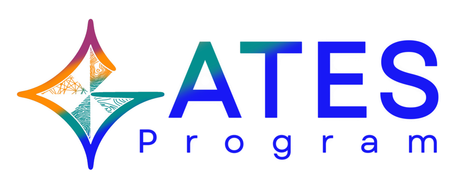
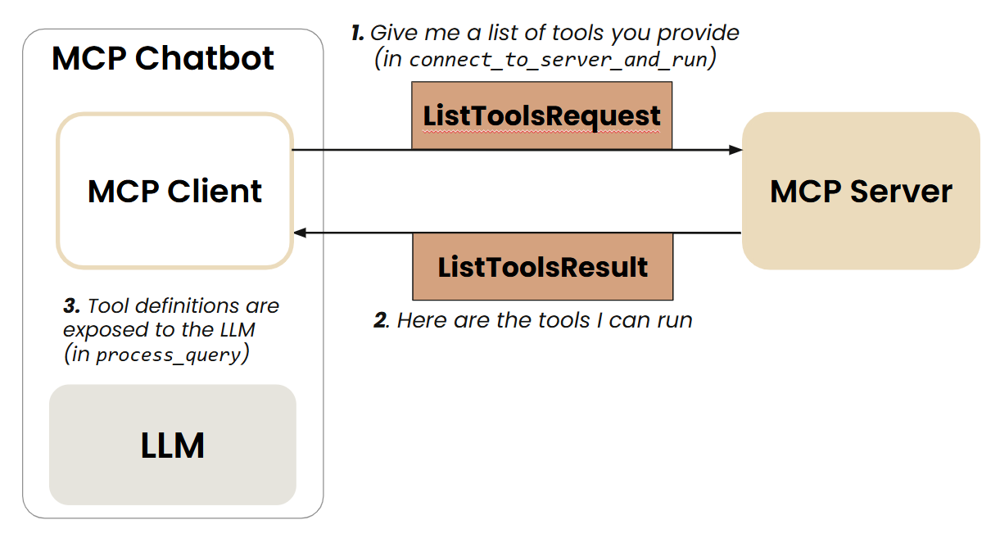
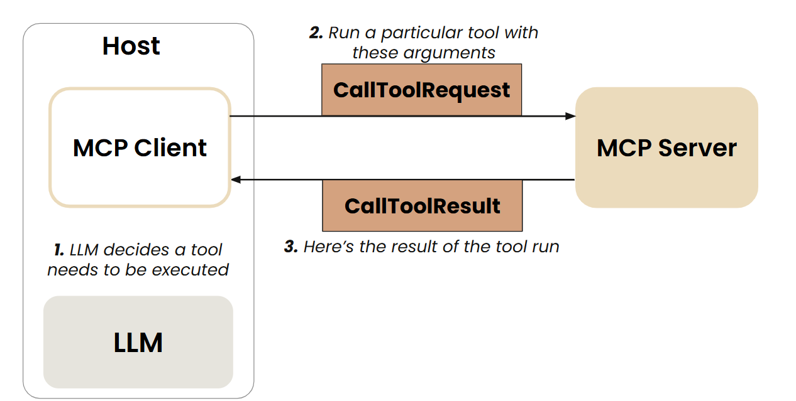

<nav class="site-nav">
<a href="index.html" class="brand"> GATES Workshop</a>
<div class="nav-links">
<a href="#lessons">Lessons</a>
<a href="presentations.html">Presentations</a>
<a href="#getting-started">Setup</a>
<a href="#resources">Resources</a>
</div>
</nav>

::: {.hero}
<div class="hero-content">
# Agentic AI in Practice: Building the OneLab Assistant

<p class="tagline">
A hands-on GATES workshop and primer on building a real, tool-using AI agent.
You'll go from individual tools, to a **Model Context Protocol (MCP) server**, to
an agent served over the **Agent2Agent (A2A) protocol**, all for one assistant over
DOST-ITDI's OneLab laboratory network. No prior agent-building experience required.
</p>

<div class="badges">
<span>Python 3.12</span>
<span>Model Context Protocol</span>
<span>Agent2Agent Protocol</span>
<span>FastMCP</span>
</div>

<div class="cta">
<a class="btn btn-primary" href="setup_guide.html">Setup Guide →</a>
<a class="btn btn-outline" href="https://github.com/gates-dost-asti/DOST-GATES-A2A-MCP-Workshop">View on GitHub</a>
</div>
</div>

<div class="hero-logo">

</div>
:::

::: {.landing-section}
## About This Workshop

This workshop is built around one real-world case study. You build the tools,
workflows, and guardrails behind an assistant for **OneLab**, the DOST-ITDI
laboratory testing network spanning the Philippines and neighboring countries.
Then you expose it as an **MCP server** any MCP-compatible client can call, and
refactor it into its own **Agent2Agent (A2A) server** that other agents can
discover and call.

By the end, you will have built and run agents across three hands-on exercises:
individual tools, an MCP server, and a standalone A2A agent, implementing the
protocols rather than just reading about them.

<div class="objective-box">
<strong>By the end of this workshop, you'll be able to:</strong>
<ul>
<li>Explain what MCP and A2A are, how they differ, and when to reach for each</li>
<li>Turn a plain Python function into a discoverable, callable tool with FastMCP</li>
<li>Give an LLM tools for SQL, retrieval (RAG), geocoding, and code generation</li>
<li>Add security guardrails (toxicity, jailbreak, and SQL-injection filtering) to an LLM-facing input</li>
<li>Refactor a chat loop into a single-turn <code>answer_query()</code> method, then describe an agent's identity and capabilities with an AgentCard/AgentSkill and serve it over HTTP with A2AStarletteApplication</li>
</ul>
</div>
:::

::: {.landing-section}
## Core Concepts, in Plain Terms

<div class="concept-grid">

<div class="concept-card">
<h3>🔌 What is MCP?</h3>
<p>The <strong>Model Context Protocol</strong> is a standard way to expose
functions, or "tools," to an LLM and to any client that speaks the protocol.
Instead of hard-wiring a chatbot to a fixed set of Python functions, you stand up
an <strong>MCP server</strong> that advertises what it can do; any
<strong>MCP client</strong> (a chatbot, an IDE, another agent) can discover those
tools at runtime and call them.</p>
<p class="concept-analogy">Think of it as a USB port for tools: one interface, any compatible client can plug in.</p>
</div>

<div class="concept-card">
<h3>🤝 What is A2A?</h3>
<p>The <strong>Agent2Agent Protocol</strong> does for whole <em>agents</em> what MCP
does for tools. An agent publishes an <strong>AgentCard</strong> (its identity and
capabilities) and one or more <strong>AgentSkills</strong> (what it can be asked to
do). Other agents, or a human-facing client, can discover an AgentCard, then call
that agent over HTTP without knowing anything about its internals.</p>
<p class="concept-analogy">Where MCP connects an agent to its tools, A2A connects agents to each other.</p>
</div>

<div class="concept-card">
<h3>🧩 How they fit together</h3>
<p>A single agent is often <em>both</em> an MCP client and an A2A server at once:
it calls out to MCP tools to get work done (e.g. querying a database), and it
exposes itself over A2A so other agents can hand it tasks. Exercise 3 builds
exactly this: the OneLab assistant becomes an MCP client internally, and an A2A
server externally.</p>
</div>

</div>
:::

::: {.landing-section}
<span id="lessons"></span>

## Lessons

<ol class="lesson-list">
<li>
<a class="lesson-title" href="Exercise-1.html">Exercise 1: Building the Tools and Workflows</a>
<span class="desc">Build the txt2sql, RAG, waypoints, nearest-labs, and hotspot-analysis workflows, an HTML map visualization tool, and the toxicity/jailbreak/SQL-injection threat filter that guards them.</span>
</li>
<li>
<a class="lesson-title" href="Exercise-2.html">Exercise 2: Creating an MCP Server</a>
<span class="desc">Wrap the five workflows as MCP tools with FastMCP, run the server over stdio, and inspect it with the MCP Inspector.</span>
</li>
<li>
<a class="lesson-title" href="Exercise-3/Exercise-3.html">Exercise 3: Refactoring the Chatbot for A2A</a>
<span class="desc">Turn the interactive <code>MCP_ChatBot</code> loop into a single-turn <code>answer_query()</code> method, then wrap it in <code>onelab_agent.py</code> as an AgentCard/AgentSkill-described A2A server.</span>
<span class="notebook-link"><a href="Exercise-3/Exercise-3-solution.html">View proposed solution →</a></span>
</li>
<li>
<span class="lesson-title">Reference: the finished server and chatbot</span>
<span class="desc"><code>onelab_server/</code> and <code>onelab_chatbot/</code>: the complete, deployable MCP server plus an intent-routing chatbot client. Try the example queries in <a href="TESTQUERIES.md">TESTQUERIES.md</a>, including ones designed to test the filters themselves.</span>
</li>
</ol>

<div class="module-tools">
<strong>The 5 tools you'll build:</strong> <code>txt2sql_workflow</code>,
<code>rag_workflow</code>, <code>waypoints_workflow</code>,
<code>nearest_labs_workflow</code>, <code>analysis_workflow</code>,
plus the <code>answer_query()</code> method and the <strong>OneLab Agent</strong> A2A wrapper.
</div>
:::

::: {.landing-section}
## How MCP Fits Together

<p>A client asks the server what tools it has, then calls one. It's the same round
trip whether the "client" is a chatbot, an IDE, or another agent.</p>

<div class="gallery">
<figure>

<figcaption>1. Client discovers available tools</figcaption>
</figure>
<figure>

<figcaption>2. Client invokes a tool by name</figcaption>
</figure>
<figure>

<figcaption>3. Server responds with its tool list</figcaption>
</figure>
<figure>

<figcaption>4. Server executes the tool and returns the result</figcaption>
</figure>
</div>
:::

::: {.landing-section}
## What You'll Learn

<div class="feature-grid">

<div class="feature-item">
**Tool-calling workflows:** txt2sql, RAG, geocoding, and code-generation tools built from scratch on top of the OpenAI API.
</div>

<div class="feature-item">
**MCP servers and clients:** expose Python functions as discoverable tools with FastMCP and call them over stdio.
</div>

<div class="feature-item">
**Agent2Agent protocol:** describe an agent with an AgentCard/AgentSkill and serve it with A2AStarletteApplication.
</div>

<div class="feature-item">
**Geospatial analysis:** nearest-lab search, waypoints/directions, and province-level hotspot and underserved-area analysis.
</div>

<div class="feature-item">
**Security guardrails:** toxicity, jailbreak, prompt-injection, and SQL-injection filtering on user input.
</div>

</div>
:::

::: {.landing-section}
<span id="getting-started"></span>

## Getting Started

::: {.callout-setup}
**Prerequisites:** VS Code, Miniconda, Python 3.12, and Node.js LTS. Comfortable
reading Python and running Jupyter notebooks. No prior MCP/A2A experience needed.
Full step-by-step install instructions (VS Code extensions, conda environment,
kernel selection) are in the **[Setup Guide](setup_guide.html)**.
:::

```bash
conda create -n gates_workshop_env python=3.12 -y
conda activate gates_workshop_env

cd path/to/workshop
pip install -r requirements.txt
```

Then open a notebook in VS Code, select the **gates_workshop_env** kernel, and
start with `Exercise-1.ipynb`.

<div class="callout-setup callout-key">
You'll also need an <code>OPENAI_API_KEY</code> in a local <code>.env</code> file,
since every exercise calls the OpenAI API. See the Setup Guide for details.
</div>
:::

::: {.landing-section}
## Repository Structure

<pre class="repo-tree">
OneLab-Workshop/
├── index.qmd                 # This site
├── Exercise-1.ipynb          # Tools &amp; workflows
├── Exercise-2.ipynb          # MCP server
├── Exercise-3/                # Refactor for A2A
├── onelab_server/            # Finished MCP server (FastMCP)
├── onelab_chatbot/           # Finished chatbot client + threat filters
├── unique_values/            # Reference value lists (agencies, tests, ...)
├── OneLab.db / population.db # Workshop datasets
├── TESTQUERIES.md            # Example queries per workflow
├── setup_guide.html          # Environment setup guide
└── requirements.txt
</pre>
:::

::: {.landing-section}
## Glossary

<dl class="glossary">
<dt>MCP (Model Context Protocol)</dt>
<dd>An open standard for exposing tools/functions to LLMs and clients in a discoverable, self-describing way.</dd>
<dt>MCP server</dt>
<dd>A process that advertises a set of tools (name, description, input schema) and executes them when called. Built here with <strong>FastMCP</strong>.</dd>
<dt>MCP client</dt>
<dd>Anything that talks to an MCP server: a chatbot, the MCP Inspector, an IDE, or another agent.</dd>
<dt>stdio transport</dt>
<dd>The simplest MCP transport: client and server communicate over standard input/output of a local subprocess. Used throughout this workshop.</dd>
<dt>A2A (Agent2Agent Protocol)</dt>
<dd>An open standard for agents to advertise their capabilities and receive tasks from other agents over HTTP.</dd>
<dt>AgentCard</dt>
<dd>A small JSON document describing an agent's identity, URL, and skills. It's the A2A equivalent of an MCP tool list.</dd>
<dt>AgentSkill</dt>
<dd>One capability an agent exposes as part of its AgentCard.</dd>
<dt>A2AStarletteApplication</dt>
<dd>The ASGI application (built on Starlette) that serves an agent's AgentCard and handles incoming A2A task requests.</dd>
<dt>RAG (Retrieval-Augmented Generation)</dt>
<dd>Answering a query by first retrieving relevant document passages, then grounding the LLM's response in them.</dd>
<dt>txt2sql</dt>
<dd>Translating a natural-language question into a SQL query that can be run against a structured database.</dd>
<dt>Guardrails</dt>
<dd>Input/output filters that catch toxicity, jailbreak attempts, prompt injection, and SQL injection before they reach the LLM or database.</dd>
</dl>
:::

::: {.landing-section}
<span id="resources"></span>

## Resources

<div class="resource-list">
- [Model Context Protocol](https://modelcontextprotocol.io/): protocol spec and docs
- [Agent2Agent Protocol](https://a2a-protocol.org/) &middot; [Python SDK](https://a2a-protocol.org/latest/sdk/python/api/)
- [Starlette](https://www.starlette.io/): the ASGI framework behind the A2A server built in Exercise 3
- [uv](https://docs.astral.sh/uv/getting-started/installation/#pypi): the Python environment/package manager used to run the A2A agent in Exercise 3
- [Node.js](https://docs.npmjs.com/downloading-and-installing-node-js-and-npm): required for the MCP Inspector
</div>
:::

<footer class="landing-footer">

<div>GATES Workshop &middot; DOST-ASTI</div>
</footer>
