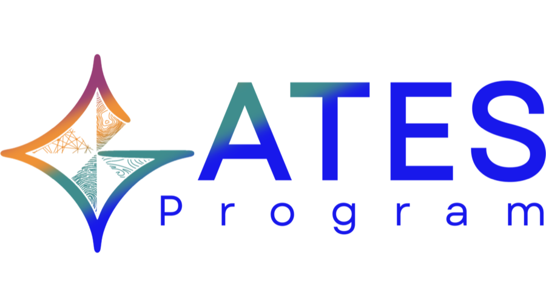

<nav class="site-nav">
<a href="index.html" class="brand"> GATES Workshop</a>

<a href="index.html#lessons">Lessons</a>
<a href="presentations.html" class="current">Presentations</a>
<a href="index.html#getting-started">Setup</a>
<a href="index.html#resources">Resources</a>

</nav>

<a class="back-link" href="index.html">← Back to workshop overview</a>
<h1>Lecture Presentations</h1>

The slide decks used in this workshop's live sessions, covering the GATES AI
ecosystem and each agentic AI, MCP, and A2A module. Open in the browser or
download for offline reference.

::: {.landing-section}
## Slide Decks

<ol class="lesson-list">
<li>
<a class="lesson-title" href="presentations/gates-ai-ecosystem-overview.pdf">The GATES AI Ecosystem</a>
An overview of the wider GATES AI ecosystem that this workshop's OneLab assistant is built within.
</li>
<li>
<a class="lesson-title" href="presentations/01-agentic-ai-module-1.pdf">Module 1: Agentic AI</a>
Foundations of agentic AI and tool-calling workflows, covered in Exercise 1.
</li>
<li>
<a class="lesson-title" href="presentations/02-agentic-ai-module-2-5.pdf">Module 2.5: Agentic AI</a>
A follow-on module extending the agentic AI foundations from Module 1.
</li>
<li>
<a class="lesson-title" href="presentations/03-agentic-ai-module-3.pdf">Module 3: Agentic AI</a>
Continued agentic AI concepts building toward the MCP server exercise.
</li>
<li>
<a class="lesson-title" href="presentations/04-agentic-ai-module-4.pdf">Module 4: Agentic AI</a>
The final agentic AI module ahead of the Model Context Protocol lecture.
</li>
<li>
<a class="lesson-title" href="presentations/06-model-context-protocol.pdf">Model Context Protocol</a>
How MCP servers and clients expose and discover tools, covered in Exercise 2.
</li>
<li>
<a class="lesson-title" href="presentations/07-agent-to-agent-protocol.pdf">Agent-to-Agent Protocol</a>
How A2A lets agents advertise capabilities and hand off tasks, covered in Exercise 3.
</li>
</ol>
:::

<footer class="landing-footer">

GATES Workshop &middot; DOST-ASTI

</footer>
